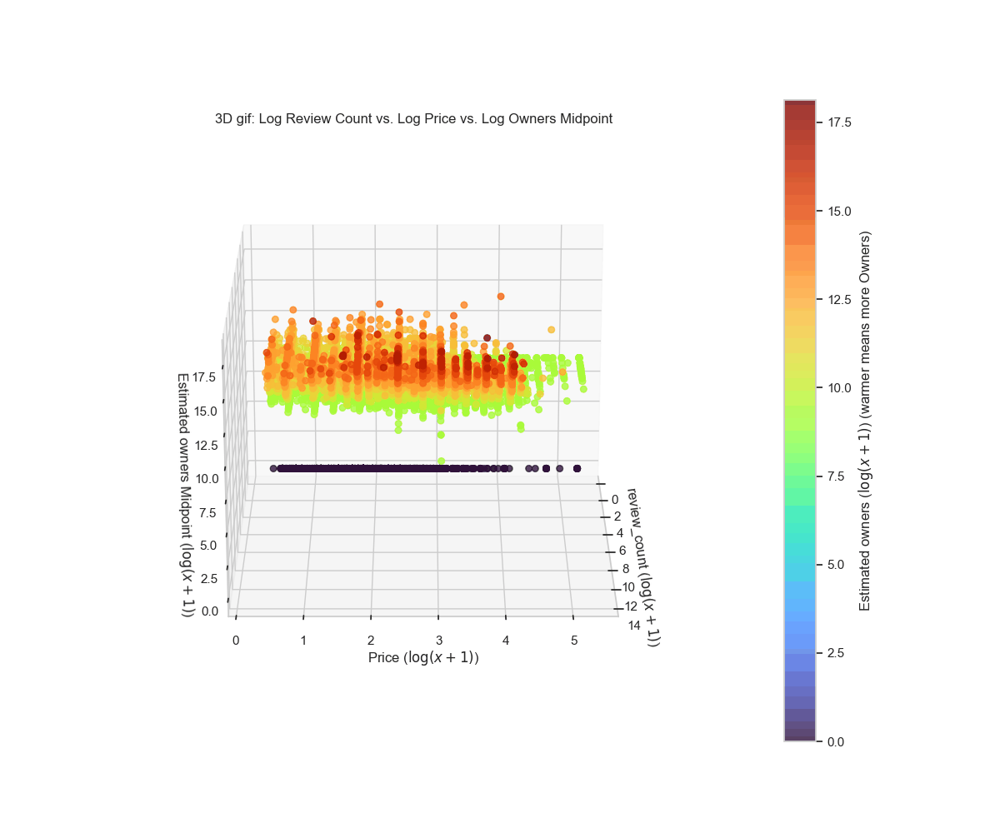
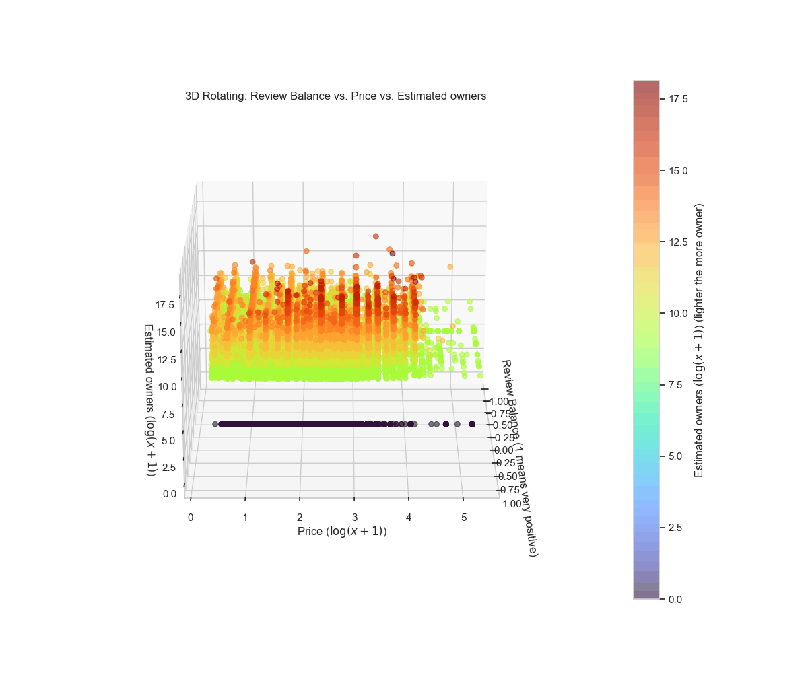

# 2025-Data-Science Steam遊戲熱門程度預測及分析

## Table of Contents
* [專案介紹](#專案介紹)
* [資料庫介紹](#資料庫介紹)
* [資料前處理概述](#資料前處理概述)
* [環境安裝](#環境安裝)
* [程式執行與結果重現](#程式執行與結果重現)
* [EDA視覺化補充](#eda視覺化補充)

## 專案介紹
本專案以 Hugging Face 提供的 Steam Games Dataset 為基礎，透過資料清理、特徵工程與探索式資料分析，探討影響 Steam 遊戲**熱門程度**的關鍵因素，並建立迴歸模型預測遊戲的預估擁有者數（owners_log）。

專案依序實作資料前處理、EDA、Baseline 模型、決策樹迴歸與隨機森林迴歸，評估不同方法在 MAE、RMSE 與 R² 等指標上的表現，並結合特徵重要性分析，說明評論數、價格、發行年份等特徵對遊戲熱門程度的影響。透過依照 README 指示執行各個 Notebook，使用者可完整重現報告中的圖表與模型結果。

### 專案成果
* **最佳模型：** **隨機森林迴歸** (Random Forest Regression) 在測試集上獲得最佳表現，**R² 達到 0.8363**。
* **關鍵影響因素：** 特徵重要性分析顯示 **評論數 (review_log)、遊戲價格(price_log)** 是影響遊戲熱度最主要的因素。

## 資料庫介紹

本專題所使用之資料集來源為 Hugging Face 所提供的 **Steam Games Dataset**，該資料集彙整自全球最大數位遊戲發行平台 Steam，包含大量遊戲之基本資訊、價格、評論與分類等資料，適合用於分析影響遊戲熱門程度之相關因素。

資料來源：[Steam Games Dataset (via Hugging Face)](https://huggingface.co/datasets/FronkonGames/steam-games-dataset)

### 資料集基本資訊
* 平台：Steam
* 遊戲數量：83,560
* 特徵數量：39

### 目標變數說明
本專題之目標變數為 `Estimated owners`，屬於**連續型數值**，代表遊戲的總擁有者數量區間，用以衡量遊戲在平台上的熱門程度。
### 主要特徵類型摘要
資料集中包含多個面向之特徵，本專題於後續分析與模型建構中，特別關注以下幾類特徵：

* 價格相關特徵：`price`
* 評價與評論相關特徵：`userScore`、`reviews`、`positive`、`negative`
* 發行時間相關特徵：`releaseDate`
* 遊戲分類相關特徵：`categories`、`genres`

## 資料前處理概述

1. 數據清理與空值處理
2. 對數轉換：
    由於多數數值型變數（如擁有者數、評論數與價格）之分佈呈現右偏特性(right skew)。因此本專題於資料前處理階段對部分變數進行對數轉換（Log Transformation），來降低分佈偏斜對模型穩定性之影響。

    例如，模型最終預測之目標變數為轉換後的 `owners_log`。
    其他轉換特徵： `review_log`, `price_log` 等。

3. 特徵工程與衍生特徵：
為了捕捉影響遊戲熱門度的潛在因素，我們從原始數據中提取並計算了多個衍生特徵。例如：`review_balance`, `positive_rate`等。


## 環境安裝

### 建議版本: Python 3.10+

### 安裝相關套件

```bash 
pip install pandas numpy matplotlib seaborn scikit-learn
```


## 程式執行與結果重現

本專題之所有分析流程與模型結果皆可透過依序執行下列 Notebook 完整重現。資料集將於執行過程中自動自 Hugging Face 下載，無須事先準備。

* 請先依「環境安裝」章節完成實驗環境設定。
* 請將所有檔案放置在同一個資料夾中，並依照下列步驟順序執行各程式

### 1. 資料處理
請執行`Data_handeling.ipynb`，獲得`steam_games_featured.csv`


### 2. 探索式資料分析（EDA）
請執行`EDA.ipynb`可獲得EDA結果與相關視覺化圖表

### 3. 模型訓練

* #### Baseline
    請執行`Model_baseline.ipynb`
* #### Decision Tree Regresion
    請執行`Model_DT.ipynb`

* #### Random Forest Regression
    請執行`Model_RF.ipynb`


## EDA視覺化補充
於 EDA 階段，本專題最後有透過 3D 視覺化旋轉圖（GIF）呈現多個變數與遊戲熱門程度（owner_log）之關係，藉此輔助判斷變數間是否存在明顯趨勢或現象。

本專題共製作兩組 3D 視覺化圖表，分別呈現：
* 價格、評論數與擁有者數之間的關係
* 價格、評論正面程度與擁有者數之間的關係

上述 3D 圖表於執行 `EDA.ipynb` 時自動生成，並同步提供對應 GIF 檔案，方便快速檢視分析結果。


